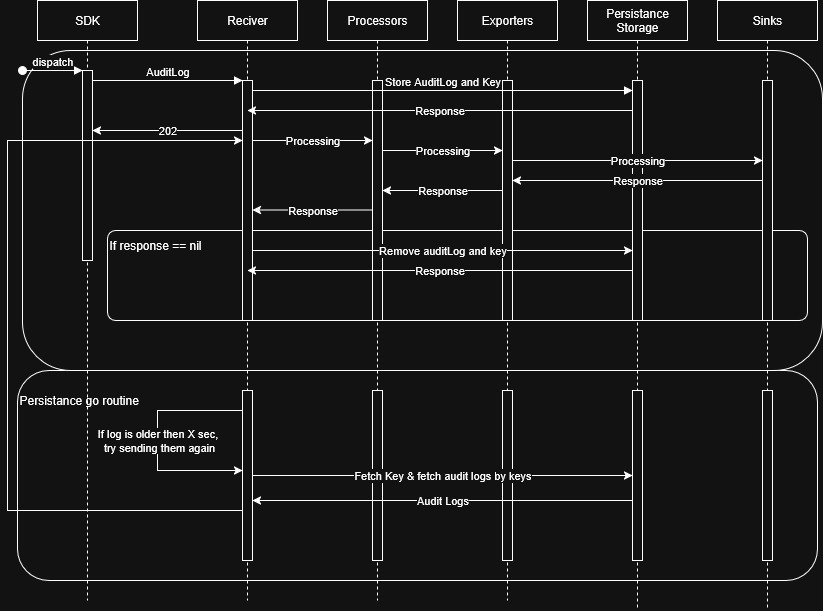

# Audit Log Receiver

The Audit Log Receiver is an OpenTelemetry Collector receiver that accepts signed audit logs over HTTP OTLP. For Tier-2 audit, use **`response_mode: sync`** with the minimal **`otelauditcol`** distribution (`cmd/otelauditcol/`).

## Sync delivery guarantees

For the recommended Tier-2 audit pipeline (`response_mode: sync`, SDK `WaitOnExport: true`, `certificatelogverify` only in the `logs` pipeline):

- **Storage is required** — The receiver fails startup without a configured storage extension. Each sync request is written to a WAL before pipeline delivery and deleted after successful export.
- **At-least-once delivery** — Records may be delivered more than once after crashes, offline recovery, transient 503s, or rare WAL delete failures after a successful pipeline run.
- **Sink idempotency (required)** — Downstream sinks **must deduplicate on `audit.record.id`**. Treat it as an idempotency key: upsert, reject duplicates, or accept silently without a second durable write.
- **No exporter `sending_queue`** — Audit log exporters must set `sending_queue.enabled: false` so durability is not split across SDK store, receiver WAL, and exporter queue.
- **Verify keys at startup only** — `certificatelogverify` loads HMAC key and certificate once at processor startup; rotation requires a collector rolling restart (see `processor/certificatelogverifyprocessor/README.md`).

See `example-config.yaml` and `AUDITLOG_PIPELINE_PITFALLS.md` for full operator guidance.

### Monitoring WAL health

Watch collector logs (and alert on storage errors / growth of WAL `pending/` keys):

| Log message | Level | Meaning |
|-------------|-------|---------|
| `Stored sync WAL entry` | Info | Request persisted before delivery (`pending_key`, `log_records`) |
| `Cleared sync WAL entry after successful delivery` | Info | WAL deleted after pipeline success |
| `Sync delivery failed, WAL entry retained for recovery` | Warn | Transient pipeline failure; entry kept for retry/recovery |
| `Delivered but failed to delete pending entry; downstream sinks must dedupe on audit.record.id` | Error | Orphan risk — export succeeded but WAL delete failed |
| `Recovering pending sync audit logs` | Info | Startup recovery batch (`count`) |
| `Recovered and cleared sync WAL entry` | Info | Recovery replay succeeded and WAL cleared |
| `Recovery delivery failed, WAL entry retained` | Warn | Recovery replay failed transiently; entry kept |
| `Recovered but failed to delete pending entry; downstream sinks must dedupe on audit.record.id` | Error | Recovery delivered but WAL delete failed |
| `Corrupt WAL entry moved to dead letter` | Error | Unparseable WAL JSON — raw bytes in `dead_letter/corrupt_*` |
| `Failed to move corrupt WAL entry to dead letter` | Error | Corrupt entry retained in `pending/` for retry |
| `Circuit open; stored WAL entry and deferred delivery` | Info | `open_behavior: accept` — 202 returned, delivery deferred |

### Circuit breaker during backend outages

In sync mode, when the circuit breaker is open, `circuit_breaker.open_behavior` chooses:

- **`reject`** (default) — HTTP **503**, no WAL write. Use with SDK `WaitOnExport` so the app retries when the backend recovers.
- **`accept`** — Persist to WAL, HTTP **202**, deliver when the circuit closes (recovery). Use when apps cannot tolerate 503 on valid records during outages; sinks still **must dedupe on `audit.record.id`**.

## Quick Start with Docker

Use the minimal **`otelauditcol`** image (not full `otelcontribcol`). Image details: `cmd/otelauditcol/README.md`.

### Pull published image

```bash
docker pull ghcr.io/apeirora/opentelemetry-collector-contrib/otelauditcol:latest
```

### Docker Compose demo (recommended)

```bash
git clone https://github.com/apeirora/opentelemetry-collector-contrib.git
cd opentelemetry-collector-contrib/cmd/otelauditcol
docker compose up --build
```

Optional backend on the host (port 9999):

```bash
cd ../../test-standalone && go run .
```

### Endpoints (sync pipeline)

| Endpoint | Default |
| -------- | ------- |
| Audit OTLP HTTP | `https://localhost:4310/v1/audit` |
| HTTP semantics | **200** delivered, **400** verify failed, **503** transient failure |

Clients must send **signed OTLP audit logs** from the Go SDK (`sdk/auditlog`), not raw JSON. See `opentelemetry-go/testlogs/README.md`.

## Architecture (sync mode)

1. **HTTP handler** — accepts OTLP audit logs on `/v1/audit`
2. **WAL write** — persists to storage before pipeline delivery
3. **Sync pipeline** — `certificatelogverify` then exporter (blocks until done)
4. **WAL delete** — on successful delivery; retained on failure for recovery
5. **HTTP response** — reflects per-record verify/export outcome



## Configuration

Reference sync config: `example-config.yaml`.

```yaml
receivers:
  auditlogreceiver:
    endpoint: 0.0.0.0:4310
    path: /v1/audit
    response_mode: sync
    storage: redis_storage/wal
    tls:
      cert_file: /etc/otel/tls/server.crt
      key_file: /etc/otel/tls/server.key
      client_ca_file: /etc/otel/tls/ca.crt
    circuit_breaker:
      enabled: true
      open_behavior: reject

processors:
  certificatelogverify:
    mode: sync
    failure_mode: strict

exporters:
  otlp_http:
    sending_queue:
      enabled: false

service:
  pipelines:
    logs/audit:
      receivers: [auditlogreceiver]
      processors: [certificatelogverify]
      exporters: [otlp_http]
```

## Published image (GitHub Packages / GHCR)

Workflow: `.github/workflows/otelauditcol.yml` (runs on `apeirora/opentelemetry-collector-contrib`).

```text
ghcr.io/apeirora/opentelemetry-collector-contrib/otelauditcol:latest
ghcr.io/apeirora/opentelemetry-collector-contrib/otelauditcol:main
ghcr.io/apeirora/opentelemetry-collector-contrib/otelauditcol:<semver>
```

## Development

### Local binary

```bash
make otelauditcol
./bin/otelauditcol_linux_amd64 --config=receiver/auditlogreceiver/example-config.yaml
```

### Kubernetes

```powershell
./deploy-auditlog-collector.ps1              # local build + deploy
./deploy-auditlog-collector.ps1 -UsePublishedImage
```

Manifest: `cmd/otelauditcol/k8s/deployment.yaml`

## Troubleshooting

```bash
docker compose -f cmd/otelauditcol/docker-compose.yml logs -f otelauditcol
kubectl logs -n otel-audit -l app=otelcol-audit -f
```

## Related docs

- `cmd/otelauditcol/README.md` — image build, security, publish
- `AUDITLOG_PIPELINE_PITFALLS.md` — operator pitfalls
- `example-config.yaml` — full sync pipeline example
