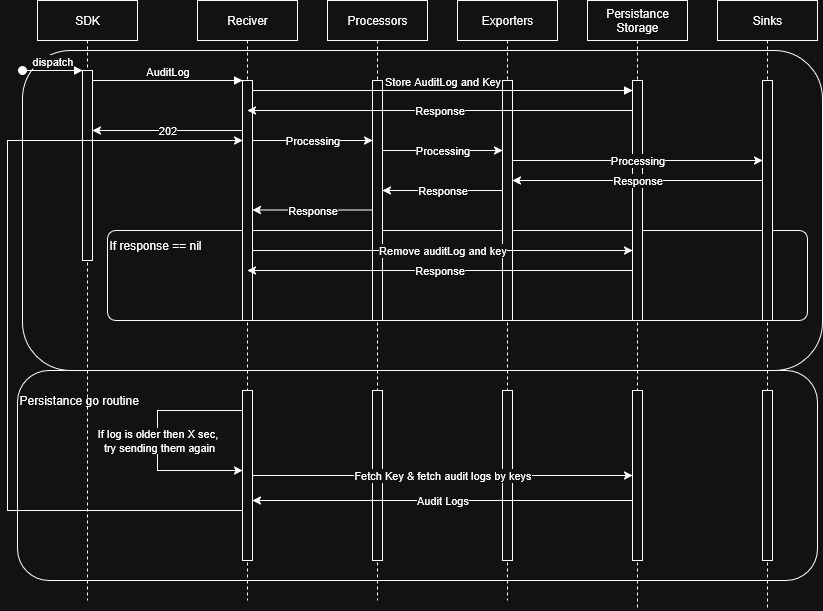

# Audit Log Receiver

The Audit Log Receiver is an OpenTelemetry Collector receiver that accepts audit log data via HTTP and processes it asynchronously using storage for persistence.

## Quick Start with Docker

### Using Published Docker Image (Recommended)

The easiest way to get started is using the pre-built Docker image from GitHub Container Registry:

```bash
# Pull the Docker image
docker pull ghcr.io/apeirora/opentelemetry-collector-contrib/otelcontribcol-auditlog:auditlogreceiver

# Run the container
docker run -d \
  --name otel-collector-auditlog \
  -p 8080:8080 \
  -p 4317:4317 \
  -p 4318:4318 \
  -v "${PWD}/storage:/var/lib/otelcol/storage" \
  "ghcr.io/apeirora/opentelemetry-collector-contrib/otelcontribcol-auditlog:auditlogreceiver"
```

### Using Docker Compose

```bash
# Clone the repository
git clone https://github.com/apeirora/opentelemetry-collector-contrib.git
cd opentelemetry-collector-contrib

# Run with docker-compose
docker-compose up -d
```

### Test the Setup

Send audit logs to the collector:

```bash
# PowerShell
Invoke-WebRequest -Uri "http://localhost:8080/v1/logs" -Method POST -ContentType "application/json" -Body '{"message": "Test audit log", "timestamp": "2024-01-01T00:00:00Z"}'

# Or with curl
curl -X POST http://localhost:8080/v1/logs \
  -H "Content-Type: application/json" \
  -d '{"message": "Test audit log", "timestamp": "2024-01-01T00:00:00Z"}'
```

**Expected Response**: `HTTP 202 Accepted`

## Architecture

The receiver implements a persistence memory pattern:

1. **HTTP Handler**: Accepts audit log requests via POST to `/v1/logs`
2. **Immediate Response**: Returns HTTP 202 Accepted immediately after storing the request
3. **File Storage**: Uses the file storage extension for persistence
4. **Background Processing**: A goroutine processes stored audit logs asynchronously

### Architecture Diagram



### Component Details

**Receiver**
- Creates a UUID and timestamp for every log received
- UUID serves as the key in storage (map-based storage) for retrieval
- Timestamp prevents duplicate processing of the same log

**Persistence Storage**
- Uses the storage extension from OpenTelemetry: [storage extension](https://github.com/open-telemetry/opentelemetry-collector-contrib/tree/main/extension/storage)
- Stored as key-value pairs with user-configurable backend options (SQL, Redis, filesystem)
- Provides user-defined persistence guarantees

**Retry Goroutine**
- Runs in a loop every X seconds, checking for logs older than X seconds in storage
- Reduces the chance of processing the same log multiple times
- Best practice: tune `ProcessAgeThreshold` to align with processing timeout settings

The diagram above illustrates the complete flow of audit log processing, including:

- **Main Flow**: SDK → Receiver → Storage → Processors → Exporters → Sinks
- **Persistence Mechanism**: Storage of audit logs with keys for durability
- **Background Processing**: Separate goroutine for processing stored logs based on age threshold
- **Retry Logic**: Failed processing attempts are retried through the persistence mechanism

## Features

- **AuditLog Receiver**: HTTP endpoint for receiving audit logs
- **Debug Exporter**: Console output for debugging
- **File Storage**: Persistent storage for audit logs
- **Circuit Breaker**: Protection against failures
- **Docker Support**: Easy deployment with Docker
- **GitHub Actions**: Automated Docker image builds

## Endpoints

- **AuditLog Receiver**: `http://localhost:8080/v1/logs`
- **OTLP gRPC**: `localhost:4317` (optional)
- **OTLP HTTP**: `localhost:4318` (optional)

## Configuration

### Receiver Configuration

```yaml
receivers:
  auditlogreceiver:
    endpoint: 0.0.0.0:8080
    storage: file_storage
    process_interval: 30s
    process_age_threshold: 60s
    circuit_breaker:
      circuit_open_threshold: 5
      circuit_open_duration: 1m
```

### Complete Example

```yaml
extensions:
  file_storage:
    directory: /var/lib/otelcol/storage
    create_directory: true

receivers:
  auditlogreceiver:
    endpoint: 0.0.0.0:8080
    storage: file_storage
    process_interval: 30s
    process_age_threshold: 60s
    circuit_breaker:
      circuit_open_threshold: 5
      circuit_open_duration: 1m

exporters:
  debug:
    verbosity: detailed

service:
  extensions: [file_storage]
  pipelines:
    logs:
      receivers: [auditlogreceiver]
      exporters: [debug]
```

## API Usage

### Send Audit Log

```bash
curl -X POST http://localhost:8080/v1/logs \
  -H "Content-Type: application/json" \
  -d '{"event": "user_login", "user": "john.doe", "timestamp": "2024-01-01T00:00:00Z"}'
```

**Response**: HTTP 202 Accepted

## Data Flow

1. **Request Received**: HTTP POST request arrives at `/v1/logs`
2. **Store**: Request body is stored in file storage with unique ID
3. **Response**: HTTP 202 Accepted is returned immediately
4. **Background Processing**: Goroutine processes stored entries every second
5. **Log Processing**: Each entry is processed and marked as completed

## Storage Format

Audit log entries are stored as JSON with the following structure:

```json
{
  "id": "audit_log_1",
  "timestamp": "2024-01-01T00:00:00Z",
  "body": "{\"event\": \"user_login\", \"user\": \"john.doe\"}",
}
```

## Testing

### Building and Running

1. **Build the receiver:**
   ```bash
   go build .
   ```

2. **Run with test configuration:**
   ```bash
   otelcol-contrib --config testdata/config.yaml
   ```

3. **Test the receiver:**
   ```bash
    cd /test-standalone
    go run main.go

### Manual Testing

Send audit logs using curl:

```bash
curl -X POST http://localhost:8080/v1/logs \
  -H "Content-Type: application/json" \
  -d '{"event": "user_login", "user": "john.doe", "timestamp": "2024-01-01T00:00:00Z"}'
```

Expected response: `HTTP 202 Accepted`

## GitHub Actions

The project includes automated Docker image builds via GitHub Actions:

- **Automatic Builds**: On push to `AuditLogReceiver` branch
- **Container Registry**: Images published to GitHub Container Registry
- **Multi-platform**: Supports Linux/AMD64 architecture
- **Semantic Versioning**: Automatic tags for releases

### Access Your Docker Image

```bash
# Pull the latest image
docker pull ghcr.io/apeirora/opentelemetry-collector-contrib/otelcontribcol-auditlog:auditlogreceiver

# View available tags
docker pull ghcr.io/apeirora/opentelemetry-collector-contrib/otelcontribcol-auditlog:latest
```

## Development

### Local Development

```bash
# Build locally
make otelcontribcol

# Run with local config
./bin/otelcontribcol_windows_amd64.exe --config=auditlog-config.yaml
```

### Docker Development

```bash
# Build and run
docker-compose up --build

# View logs
docker-compose logs -f

# Stop
docker-compose down
```

## Troubleshooting

### Permission Issues

If you encounter permission issues with storage:

```bash
# Create storage directory with proper permissions
mkdir -p storage
chmod 755 storage
```

### Container Not Starting

Check container logs:

```bash
docker logs otel-collector-auditlog
```

### Port Already in Use

Change the port mapping in `docker-compose.yml`:

```yaml
ports:
  - "8081:8080"  # Use port 8081 instead
```

### Check Container Status

```bash
# Check if container is running
docker ps

# Check container logs
docker logs otel-collector-auditlog

# Check container details
docker inspect otel-collector-auditlog
```

## Benefits

- **High Throughput**: Immediate HTTP responses allow for high request rates
- **In-Memory Storage**: Fast storage with background processing
- **Asynchronous Processing**: Background processing prevents blocking HTTP requests
- **Scalability**: Can handle burst traffic by queuing requests
- **OTLP Protocol Support**: Accepts both JSON and protobuf content types
- **Docker Ready**: Pre-built Docker images available
- **CI/CD**: Automated builds and deployments

## File Structure

```
├── Dockerfile                 # Main Dockerfile
├── docker-compose.yml        # Docker Compose configuration
├── auditlog-config.yaml      # Collector configuration
├── .github/workflows/        # GitHub Actions
└── storage/                  # Persistent storage directory
```

## TODO

- **Circuit Breaker**: ✅ Implemented circuit breaker for retry operations
- **Logging Improvements**: Fix logging of processed logs (count only valid ones)
- **Persistence Queue Analysis**: Investigate how persistence queue in exporters may affect the amount of logs delivered and overall flow